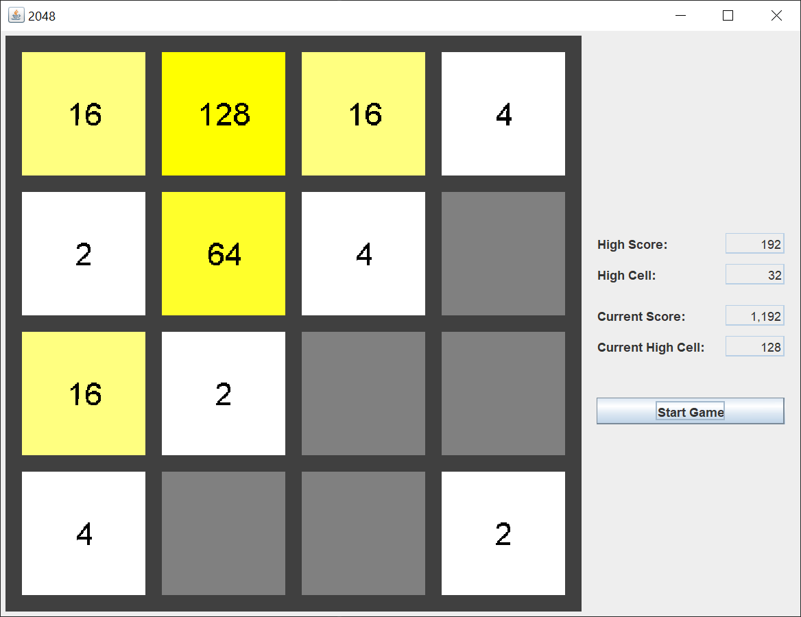

# 2048

## Introduction

A while back, I came across a game called 2048. The game was created by [Gabriele Cirulli](https://play2048.co/). It’s an interesting variation on a 4 x 4 sliding puzzle.

If you’re not familiar with Java Swing, Oracle has an excellent tutorial to get you started, [Creating a GUI With JFC/Swing](https://docs.oracle.com/javase/tutorial/uiswing/index.html). Skip the Netbeans section.

Here’s a screenshot of my Java Swing version of 2048. It will help you understand the rules.

The 2048 game starts with an empty 4 x 4 grid. Two tiles are placed on the grid at random locations. The tiles will either have a 2 value or a 4 value. There’s a 90% chance that a new tile will have the 2 value and a 10% chance that a new tile will have the 4 value.

You use the arrow keys, or the WASD keys if you’re left handed, to slide the tiles up, left, down, or right. All of the tiles move as far as they can in that direction.

When two tiles of the same value are next to each other, and you press the arrow key in that direction, they combine to form a tile with the next highest power of 2. For example, when two 2 tiles are in the top row and you press the right or the left arrow key, they combine to form a 4 tile. You can see in the screenshot that there are tiles with the value 2, 4, 8, and 16. Two 2 tiles combine to form a 4 tile. Two 4 tiles combine to form an 8 tile. Two 8 tiles combine to form a 16 tile. And so on.

One new 2 or 4 tile is placed in a random empty location each time the tiles are moved and / or combined.

The object of the game is to get a 2048 tile. Failing that, the object is to get as high a score as possible. You can see in the screenshot that the highest tile I’ve made is a 128 tile. The game ends when no more new tiles can be placed on the grid and no tiles can be combined.

You can find 2048 strategy tips in various places on the Internet. The main idea is to keep the highest value tiles in one of the four corners. There’s some luck involved, as the new tiles appear in random locations.

## Explanation

I used a [model / view / controller](https://en.wikipedia.org/wiki/Model%E2%80%93view%E2%80%93controller) pattern (MVC) when putting this Java Swing application together. I have 2 model classes, 5 view classes, and 5 controller classes. The MVC pattern separates the concerns and allows me to focus on one part of the Java Swing application at a time.

Let’s look first at the main application class, Game2048.  Game2048 is short and to the point. This class does 3 things.

1. Starts the Java Swing application on the Event Dispatch thread (EDT).
2. Creates an instance of the game model.
3. Creates an instance of the game JFrame.

Every Java Swing application has to do these 3 things. This type of class is how I start every Java Swing application.

### Model

Next, let’s look at the main model class, Game2048Model.  This class keeps the score, lets the rest of the game classes know whether or not the arrow keys are active, and maintains the 4 x 4 game grid. This class also draws the game grid. I know, I said earlier that I separate the model from the view. The reason that the drawing code is included in the model is that it’s easier for Java objects to draw themselves. While the drawing code is included in the model, it’s executed as a part of the view.

The code to move the tiles is a part of the model. It took me a couple of days to get the code correct for moving the tiles. I can’t recall the last time I had to use a do while loop structure.

This class has a DEBUG boolean. Setting this boolean to true activates a couple of System.out.println statements that helped me to debug the tile move code. This is one way to debug complicated logic without having to step through the code with a debugger.

Next, let’s look at the Cell model class.  This class maintains the value. If it wasn’t for the drawing code, this class could be replaced by an int. The cellLocation Point and the drawing code make up the remainder of the class. The most interesting code is in the createImage method, where we attempt to center the text containing the value of the cell.

Coming up with a sequence of colors was interesting. My idea was to make the yellow color deeper and richer as the tile values increased. Unfortunately, the RGB color spectrum isn’t large enough to make 10 different distinct yellow colors just by varying the hue.

### View

Let’s look at the view classes. The first is the Game2048Frame class.  We get the high scores from a properties file in the constructor. Later, we’ll see the HighScoreProperties class that saves and loads the high scores.

The createPartControl method uses a JFrame to create the game window. Notice that we use a JFrame. We do not extend a JFrame. The only time you should extend a Swing component, or any other Java class, is when you want to override one or more of the class methods.

We have a WindowAdapter in the createPartControl method to listen for when the game window closes. This is so we can get the high score and write it to the properties file before we destroy the window and exit the game.

We create 3 JPanels for the game, the grid panel, the score panel, and the control panel. The score and control panels are placed in a side JPanel. The grid panel and side panel are placed in a main JPanel. The main JPanel is placed in the JFrame. You will save yourself a lot of grief if you always have a main JPanel to put the rest of your Swing components in. JFrames were not designed to hold lots of Swing components.

We define the key bindings in the JFrame class, even though they are attached to the grid panel. I could have attached these key bindings to any of the Swing components in the game. The grid panel seemed the most logical. As soon as you click on the Start Game button in the control panel, the grid panel loses focus. That’s why I have key bindings defined as WHEN_IN_FOCUSED_WINDOW.

A JPanel has WHEN_FOCUSED key bindings defined for the left and right arrow keys. I have no idea what action is defined, but it’s not my action. That’s why I defined WHEN_FOCUSED key bindings as well for the arrow keys.

Towards the bottom, there are 2 convenience methods that allow me to repaint the grid panel and update the score panel. These methods are called by the controller classes. Having these methods in the Game2048Frame class allows me to pass just the instance of the JFrame class to the controller classes. The controller classes don’t have to know the internals of the view classes.

Next, we’ll look at the grid panel class, GridPanel.  Since most of the drawing code is included in the model, there’s not much code here. We extend JPanel because we want to override the JPanel paintComponent method. If the game is over, we draw a game over image over the grid panel.

Next, we’ll look at the GameOverImage class.  The most interesting thing here is that we have an alpha component to the image to make the majority of the image transparent. The “Game Over” text is opaque. There is also code to center the text, which is similar to the code in the Cell class to center the value text.

Next, we’ll look at the score panel class, ScorePanel.  This class uses a GridBagLayout to lay out the labels and fields in a grid. The addComponent method creates a GridBagConstraints for each Swing component.

The updatePartControl method updates the score fields.

These are the relationships between the model, view, and controller in the MVC pattern:

1. The view may get values from the model.
2. The view may not update values in the model.
3. The controller will update values in the model and may update the view.

Next, we’ll look at the control panel class, ControlPanel.  This class uses a GridBagLayout to lay out the button in a grid. The GridBagLayout is overkill for one button, but is useful for laying out a column of buttons. The GridBagLayout ensures that all of the buttons are the same width. The addComponent method creates a GridBagConstraints for each Swing component.

Clicking on the “Start Game” button triggers the StartGameActionListener.

### Controller

We’ll look at the StartGameActionListener class now.  Most of the code resides in the model and view classes. The actionPerformed method performs the necessary model and view methods to start the game. Since this code is executed quickly, we perform it inline. If the code took a long time to execute, we wouldn’t want to tie up the EDT. We execute long running code in a separate thread.

Next, we’ll look at the other action classes. These classes are triggered by one of the arrow keys.

We’ll look at the UpArrowAction class.  The actionPerformed method moves the cells up. If any cells move, then the game over test is performed. If the game is over, the arrow keys are logically disabled. The arrow keys still trigger the actions, but since the actions check if the arrow keys are enabled, nothing happens.

If any cells move, and the game is not over, a new 2 or 4 value cell is placed in a random location on the grid. The view is updated.

Since this actionPerformed code is executed quickly, we perform it inline. If the code took a long time to execute, we wouldn’t want to tie up the EDT. We execute long running code in a separate thread.

The LeftArrowAction, DownArrowAction, and RightArrowAction classes are very similar. The only difference is which move method in the model is performed. They are presented now without additional comments.

Finally, we have the HighScoreProperties class. I put the high score in a properties file so that I could save it. Yes, I could go into the properties file and change the high score manually. If you’re writing a game for other people to play, you’ll need to obfuscate the values so they cant be easily changed. One way to do this would be to add a check digit to the values.

I wrote the properties file to the same directory as my Java project. You should change the file name to point to a user directory.
